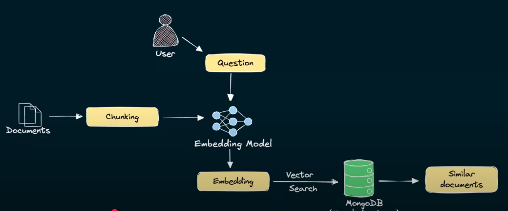

Building RAG Application Using MongoDB
======================================

https://www.youtube.com/watch?v=ClYdveChNzU&list=PLA7_s1Rr75__bDXI4PUCB9dCpk9EJQd3O[YouTube - Building RAG Application Using MongoDB^]

=== Retrievals
The three phases in retrieval:

. Chunking
. Embedding
. Vector Searching

NOTE: Chunking and Embedding are for _data preparations_ +
      Vector Searching is for the _searching_ and _returning_ results.
      
==== Chunking
The breaking down of large piece of text into smaller `segments` or `chunks`.

* Reduce generation costs
* Focus the attention of the LLM on the most relevant information.

===== Ways of Chunking

NOTE: https://www.mongodb.com/developer/products/atlas/choosing-chunking-strategy-rag/?utm_term=apoorva.joshi[More on Chunking^]

TIP: Chunking provides semantic meanings to our data, so that we can use __natural language__ for our queries.

==== Embeddings

===== How to embed data

===== Embedding chunk content

